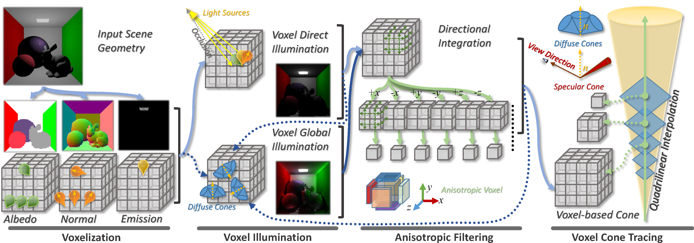
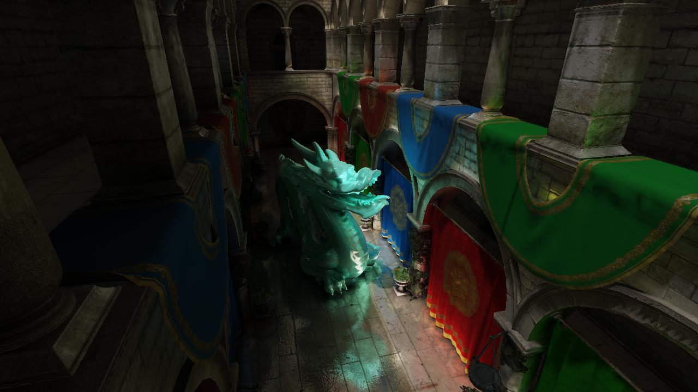
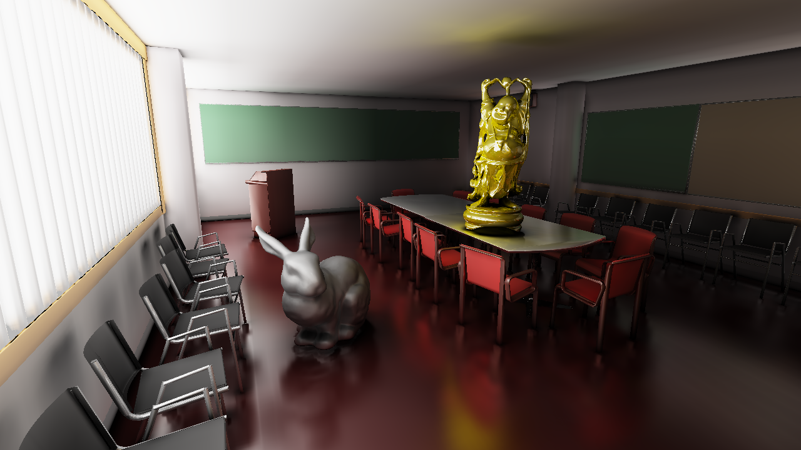
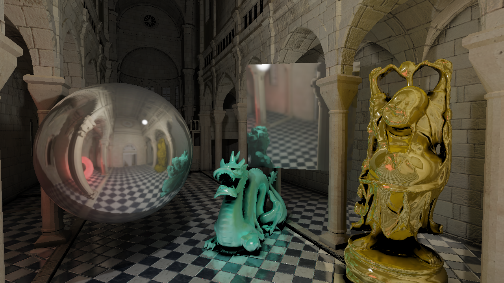
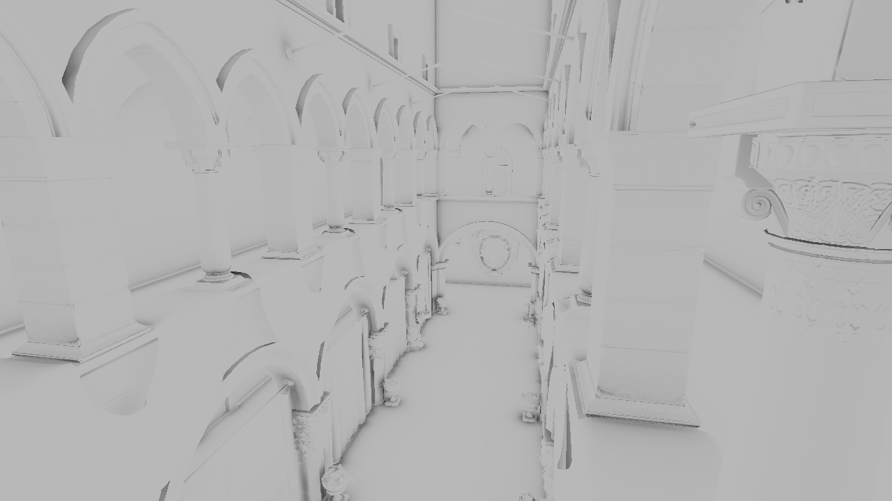
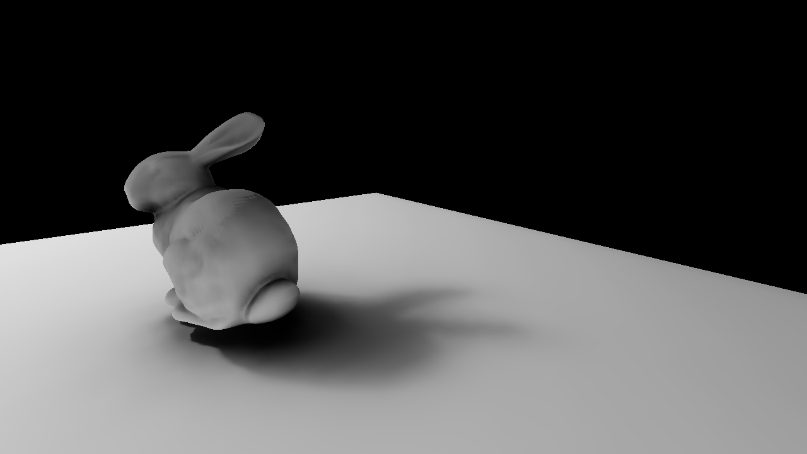
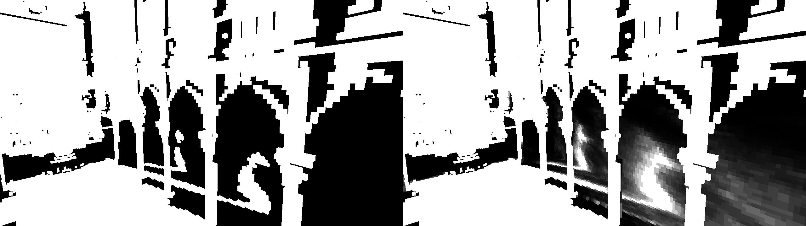
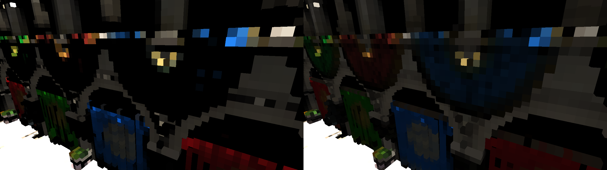
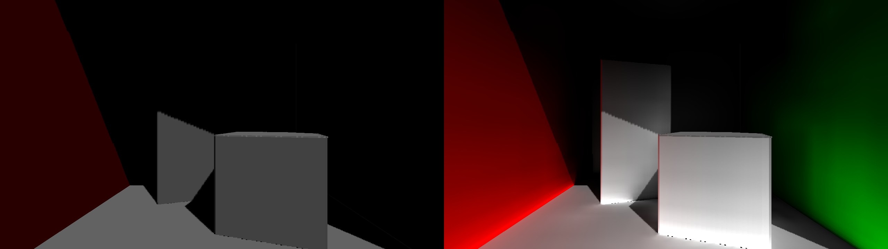
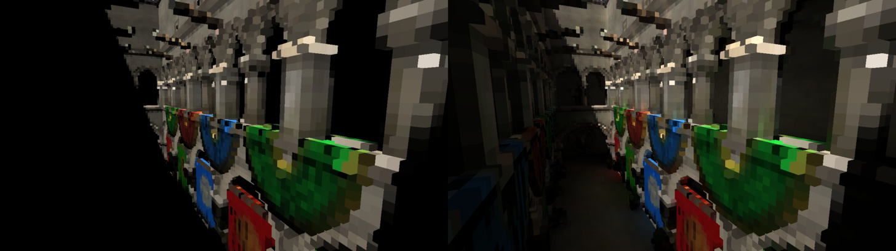

# VCTRenderer
Interactive global illumination using a hierarchical voxel representation with anisotropic voxels stored in volumetric textures and voxel cone tracing. Achieved effects such as: glossy surfaces, diffuse reflection, specular reflection, indirect shadows, soft shadows, emissive materials and 2-bounce GI.

https://www.youtube.com/watch?v=HwGSoTyP-oM

https://www.youtube.com/watch?v=52nkpkVZt-g

https://www.youtube.com/watch?v=e1r5VrDtG7k

Global Illumination

Specular Reflection

Emissive Materials and Indirect Shadows

Ambient Occlusion

Soft Cone Traced Shadows

Single Ray Soft Shadows for Voxel Occlusion.

Directional Voxel Shading (Reduces Normal Voxelization Issues)

Voxel Diffuse Global Illumination

http://ieeexplore.ieee.org/abstract/document/7833375/
